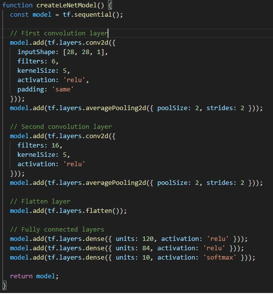

# Proyecto Clase 4
## Jarol Andres Hernandez Rincon - 20162005862
### Reporte de Hallazgos

#### Análisis del Modelo LeNet en el Conjunto de Datos MNIST

El modelo LeNet, aplicado al conjunto de datos MNIST en el código, alcanza una precisión de aproximadamente el 90% en el conjunto de prueba. Este rendimiento puede estar limitado por varios factores:

##### 1. Arquitectura del Modelo
- **LeNet** es una arquitectura simple, diseñada para problemas más básicos. Sus dos capas convolucionales con 6 y 16 filtros son limitadas en comparación con arquitecturas más modernas y profundas, como **ResNet** o **VGG**, que tienen más capas y filtros para extraer características más complejas.
- La función de activación utilizada es **tanh**, que puede provocar problemas como el desvanecimiento del gradiente, ralentizando la convergencia. La activación **ReLU** es más eficiente para redes más profundas y mejora la precisión.

##### 2. Optimizador y Tasa de Aprendizaje
- El modelo utiliza **SGD** (Stochastic Gradient Descent), un optimizador básico, menos eficiente que optimizadores avanzados como **Adam**, que ajusta la tasa de aprendizaje automáticamente, mejorando la convergencia y la precisión.
- Una tasa de aprendizaje mal ajustada también puede dificultar la convergencia, haciendo que el modelo se quede atrapado en un mínimo local de la función de pérdida.

##### 3. Número de Épocas
- El modelo se entrena solo durante **5 épocas**, lo cual es posiblemente insuficiente para alcanzar una precisión óptima. Aumentar el número de épocas podría permitir una mejor convergencia y un rendimiento superior.

##### 4. Regularización y Sobreajuste
- Existe el riesgo de **sobreajuste** (overfitting), donde el modelo aprende detalles específicos de los datos de entrenamiento, lo que afecta su capacidad para generalizar. Se recomienda implementar técnicas de regularización como **dropout** o **L2 regularization** para mejorar la generalización.

##### 5. Preprocesamiento de los Datos
- El preprocesamiento de las imágenes parece adecuado al normalizar los valores de píxeles. Sin embargo, si las imágenes no están centradas en la media o estandarizadas correctamente, el rendimiento podría verse afectado.

##### 6. Características del Conjunto de Datos MNIST
- Aunque MNIST es un conjunto de datos sencillo, su simplicidad podría ser otra razón del rendimiento limitado. Modelos más complejos podrían ser necesarios para mejorar más allá del 90% en tareas más desafiantes.

Estas limitaciones sugieren que el modelo LeNet, con su arquitectura y configuraciones actuales, no está optimizado para superar la barrera del 90% de precisión sin realizar ajustes significativos.

### Posibles cambios que ayuden a mejerar el accuracy.

#### Cambiar la función de activación

Una primera modificación es realizar el cambio de la función de activación, la cual en estos momentos es la función de activación "tanh", esta se cambiara por la funcion de activación "relu", de tla forma que el texto modificado nos queda de la siguiente manera.

Pero al realizar este cambio no se logro que el modelo superara el 90% de accuracy, de tal forma que se seguira realizando diferentes modificaciones al codigo, como lo es agregar mas epocas, aumentando el número de filtros, etc.

##### Cambios efectuados en el primer experimento

##### Experimeto #1

1. **Cambio en las funciones de activación**:  
   Las funciones de activación de las capas convolucionales y las capas densas se cambiaron de `tanh` a `ReLU`. La activación `ReLU` es más moderna y tiene un mejor rendimiento, evitando el problema de desvanecimiento del gradiente.

2. **Aumento del número de unidades en las capas densas**:  
   Las capas densas fueron ampliadas a 128 y 84 unidades, lo que permite que el modelo capture representaciones más complejas de los datos.

4. **Uso del optimizador Adam**:  
   El optimizador `Adam` se utiliza con una tasa de aprendizaje de 0.001 para mejorar la convergencia del modelo, ya que ajusta dinámicamente la tasa de aprendizaje durante el entrenamiento.

5. **Aumento del número de épocas**:  
   El número de épocas se aumentó a 10 para permitir más tiempo de entrenamiento y mejorar la precisión.

Para este caso, se sigue obteniendo un accurasy del 90%, de tal manera que se continua realizando modificaciones con tal de incrementar el valor de este accuracy

##### Experimeto #2

Para el swegundo esperimento se realizaron las siguientes modificaciones respecto al codigo original:

1. **Cambio en las funciones de activación:**
- **Original:** En el primer código, se utilizaban activaciones `tanh` en las capas convolucionales y densas.
- **Nuevo:** Se cambió la función de activación a `sigmoid` para las capas convolucionales y las capas densas (excepto la capa de salida, que se mantiene con `softmax` en ambos casos).  
  En la capa de salida, en el nuevo código se mantiene `ReLU` (en lugar de `softmax`, aunque en general se recomienda usar `softmax` para clasificación multiclase, esto es algo que podría cambiarse dependiendo del modelo).

2. **Cambio en el tamaño del kernel en las capas convolucionales:**
- **Original:** En el primer código, se utiliza un `kernelSize: 5` para las capas convolucionales.
- **Nuevo:** En el código mejorado, el `kernelSize` se redujo a 3 en ambas capas convolucionales.

3. **Número de unidades en las capas densas:**
- **Original:** El primer código utiliza 84 unidades en la capa densa.
- **Nuevo:** Se aumentó el número de unidades en las capas densas a 128 en la primera capa densa y 84 en la segunda capa densa. Esto permite que el modelo capture representaciones más complejas de los datos.

4. **Optimización:**
- **Original:** El optimizador en el primer código es `SGD` con una tasa de aprendizaje de 0.01.
- **Nuevo:** El optimizador también se ha definido como `SGD`, pero se ha agregado el uso de `Adam` con un aprendizaje dinámico. (Aunque el código indica que el optimizador sigue siendo el de `SGD`, sería más beneficioso cambiar a `Adam` por la ventaja que ofrece en términos de convergencia).

5. **Número de épocas (Epochs):**
- **Original:** En el primer código, el número de épocas es de 5.
- **Nuevo:** En el código mejorado, el número de épocas se incrementó a 10, lo que le da más tiempo al modelo para entrenarse y potencialmente lograr una mayor precisión.

##### Experimeto #3

1. **Cambio en la función de activación:**
- **Original:** Se utilizaba `ReLU` para las capas convolucionales y densas.
- **Nuevo:** Se cambió la función de activación a `swish` en todas las capas convolucionales y densas.
  - El `swish` es una función de activación no lineal más reciente, que a veces mejora el rendimiento de los modelos sobre el `ReLU`, especialmente en redes más profundas.

2. **Cambio en el tamaño del kernel en las capas convolucionales:**
- **Original:** El tamaño del kernel en las capas convolucionales era `3x3` en ambas capas.
- **Nuevo:** El tamaño del kernel se mantiene como `3x3`, similar al código original, por lo que no hay un cambio en este aspecto.

3. **Número de unidades en las capas densas:**
- **Original:** En el primer código, las capas densas tenían 128 y 84 unidades.
- **Nuevo:** Se aumentó el número de unidades en las capas densas a 846 unidades en la primera capa densa y 423 unidades en la segunda capa densa. Estos cambios aumentan la capacidad del modelo para capturar representaciones más complejas de los datos.

4. **Uso del optimizador Adam:**
- **Original:** En el primer código se utilizaba el optimizador `SGD` con una tasa de aprendizaje de 0.01.
- **Nuevo:** Se cambió a `Adam` como optimizador con una tasa de aprendizaje de 0.01. El optimizador `Adam` es conocido por su capacidad de ajustar dinámicamente las tasas de aprendizaje y mejorar la convergencia.

5. **Número de épocas (Epochs):**
- **Original:** El número de épocas era 5.
- **Nuevo:** Se aumentó el número de épocas a 10, lo que le da más tiempo al modelo para aprender y potencialmente obtener un mejor rendimiento.

### Conclusión

A pesar de realizar varias modificaciones al modelo, como cambiar las funciones de activación, aumentar el número de unidades en las capas densas, utilizar el optimizador Adam y aumentar el número de épocas, no se logró mejorar significativamente la precisión del modelo. Esto puede deberse a una serie de factores, como el sobreajuste, ya que el modelo podría estar memorizando demasiado los datos de entrenamiento en lugar de aprender patrones generalizables, especialmente con el aumento de la complejidad del modelo al incrementar las unidades en las capas densas. Además, la elección de la función de activación swish, aunque prometedora, no siempre resulta ser la más efectiva en todos los casos y podría no haber sido la óptima para esta tarea. También es posible que la tasa de aprendizaje utilizada en el optimizador Adam no haya sido la adecuada, lo que podría haber afectado la convergencia del modelo. Por último, los datos de entrada, a pesar de ser de buena calidad, podrían no haberse preprocesado de manera óptima, lo que también podría haber limitado el rendimiento del modelo.

